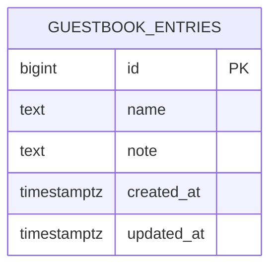

# Database Design (ERD) — Guest Book

Engine: PostgreSQL 16
Last updated: 2026-09-04
Source requirements: `docs/guestbook/SRS.md`

## 1. Overview

This schema stores anonymous guest book entries so visitors can read saved notes newest first and see total count after service restart. `guestbook_entries` is the only aggregate root because product scope has no accounts, moderation, edits, deletes, payments, or file storage.

## 2. Diagram

Cardinality notation: no relationships exist in current scope. Single table traces to GUESTBOOK-001, GUESTBOOK-002, and GUESTBOOK-003.

## 3. Entities

### 3.1 `guestbook_entries`

**Purpose** — Stores each public visitor name and note for later listing and counting. **Traces to** — GUESTBOOK-001, GUESTBOOK-002, GUESTBOOK-003.

| Column | Type | Null | Default | Unique | Description |
|---|---|---|---|---|---|
| `id` | `bigint` | no | `GENERATED BY DEFAULT AS IDENTITY` | PK | Surrogate key returned by `POST /entries`; SRS requires integer id. |
| `name` | `text` | no | none | no | Visitor display name, trimmed by API, 1-60 characters. |
| `note` | `text` | no | none | no | Visitor note, trimmed by API, 1-280 characters. |
| `created_at` | `timestamptz` | no | `now()` | no | Entry creation time used for display and newest-first ordering. |
| `updated_at` | `timestamptz` | no | `now()` | no | Required by project table convention; same as `created_at` because entries are not editable. |

**Nullable columns** — none.

**Foreign keys** — none; entries are anonymous and no parent entity exists.

**Constraints**

| Name | Definition | Rule enforced |
|---|---|---|
| `ck_guestbook_entries_name_length` | `CHECK (char_length(name) BETWEEN 1 AND 60)` | Reject blank or over-length name after API trimming. |
| `ck_guestbook_entries_note_length` | `CHECK (char_length(note) BETWEEN 1 AND 280)` | Reject blank or over-length note after API trimming. |
| `ck_guestbook_entries_created_at_not_future` | `CHECK (created_at <= now() + interval '1 minute')` | Prevent accidental far-future ordering timestamps while allowing small clock skew. |

**Indexes**

| Name | Columns | Type | Query it serves |
|---|---|---|---|
| `idx_guestbook_entries_created_at_id` | `created_at DESC, id DESC` | btree | `GET /entries` newest-first list with deterministic tie-break. |

**Lifecycle** — hard delete only by future maintenance migration or manual database operation. Product scope has no visitor delete, admin delete, edit, moderation, or retention workflow; no `deleted_at` column.

## 4. Enumerations

No enumerations. Current requirements have no fixed state values.

| Name | Values | Mechanism | Why |
|---|---|---|---|
| none | none | none | Not needed by SRS. |

## 5. Access patterns

| # | Pattern | Frequency | Index used |
|---|---|---|---|
| 1 | `POST /entries` inserts trimmed `name`, `note`, returns `id`, `created_at` | Every signature | Primary key generated by identity; check constraints validate stored lengths. |
| 2 | `GET /entries` returns all stored entries newest first | Every page load and after submit | `idx_guestbook_entries_created_at_id` |
| 3 | `GET /entries/count` returns total entry count | Every page load and after submit | No extra index; PostgreSQL can count single small append-only guest book table, add cached counter only if count becomes bottleneck. |
| 4 | `GET /health` / `/healthz` verifies database availability | Health checks | No table index; uses `SELECT 1` per architecture. |

## 6. Data volume and growth

| Table | Rows at launch | Growth | Retention |
|---|---|---|---|
| `guestbook_entries` | 0 | Expected small shop traffic, likely hundreds to low thousands per month | Keep indefinitely unless stakeholder later adds moderation, export, or deletion policy. |

No table expected to exceed 10M rows within a year for stated shop guest book scope. If traffic proves much higher, add pagination API and keep same `(created_at DESC, id DESC)` index.

## 7. Integrity, privacy, and security

- Database enforces durable invariants: non-null fields, identity primary key, length bounds, and deterministic ordering support. API enforces trimming and returns validation errors before insert so users receive friendly messages.
- Personal data: `name` and `note` can contain visitor-provided personal data. Retention is indefinite because SRS requires persistent guest book entries and excludes delete/moderation flows.
- Secrets: none stored in database.
- Row-level access: none. Product is public anonymous read/write with no accounts or roles.

## 8. Migrations

| # | Change | Forward | Backward | Safe on non-empty table |
|---|---|---|---|---|
| 1 | Initial schema | `001_create_guestbook_entries.up.sql`: enable `pgcrypto` only if later UUID tables need it; create `guestbook_entries`; add constraints; create `idx_guestbook_entries_created_at_id`. | `001_create_guestbook_entries.down.sql`: drop index, drop table. | n/a for initial empty database. On non-empty database, forward is additive and safe if table does not already exist; backward deletes stored entries and must not run in production without backup/approval. |

Implementation note: this ERD chooses `bigint` identity instead of UUID because SRS explicitly requires integer `id`, IDs are internal API payload fields, and smaller btree indexes are enough for append-only entries.

## 9. Story extension — Build guest book page

The reviewed UI mock module `code/frontend/lib/mock/build-guest-book-page.ts` uses this entry shape: `id`, `name`, `note`, `created_at`, plus page-level `count`, `apiUnavailableMessage`, and optional `showApiUnavailable`. Existing `guestbook_entries` columns supply every persisted entry field the page needs. `count` is derived with `COUNT(*)`; failure-message fields are frontend state, not database state.

No new entity, column, foreign key, constraint, or index is required for this story. The existing `idx_guestbook_entries_created_at_id` index remains the serving index for newest-first cards.

**Migration plan** — forward: no schema migration for this story beyond existing initial schema. Backward: no rollback action. Safe on populated table: yes, because this story adds no database change.

## 10. Open questions

None.

| Question | Owner | Blocking |
|---|---|---|
| none | none | no |
