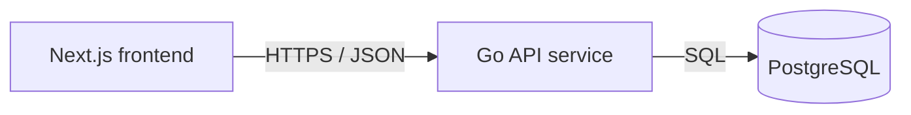

# Service & Interface Design — Guest Book

Last updated: 2026-09-04
Source: `docs/guestbook/SRS.md`, `docs/architecture/erd.md`

## 1. Service map



| Service | Responsibility | Owns (tables) | Depends on | Deploy unit |
|---|---|---|---|---|
| Guest Book API | Public HTTP JSON API for health, entry creation, entry listing, and entry count. Validates external input, trims accepted entry fields, persists entries, and returns saved data newest first. | `guestbook_entries` | PostgreSQL via `DATABASE_URL` | backend container |
| Next.js frontend | Public one-page guest book UI. Loads count and entries from API, submits entries to API, and shows friendly API failure messaging. | none | Guest Book API over HTTPS/JSON | frontend container |

**Why these boundaries** — single backend service: no extra backend boundary justified yet. Frontend and API remain separate deploy units because browser UI and server persistence have different runtimes and scaling needs.

## 2. Cross-cutting contract

### 2.1 Base

- Backend route base: `/v1` for product endpoints. The deploy proxy may expose these under `/api`; do not mount or document backend routes with `/api`.
- Health route: `/health` is unversioned because the customer requested exact path `GET /health`.
- Content type: `application/json; charset=utf-8` for every request and response with a body.
- Versioning: URL path major version. A new major version only for breaking changes. Current product endpoints use `/v1` except unversioned `/health`.
- Trace header: `X-Request-Id` accepted from caller, generated if absent, echoed on every response, and present in every request log line.
- Timestamps: RFC 3339 UTC strings, field names ending in `_at`.
- JSON field naming: `snake_case`.
- IDs: strings on the wire, even though database id is `bigint`.

### 2.2 Authentication and authorization

| Aspect | Decision |
|---|---|
| Mechanism | None. Public anonymous API by SRS scope. |
| Token lifetime | Not applicable. |
| Refresh | Not applicable. |
| Transport | No `Authorization` header required or consumed. |
| Roles | Visitor only; no accounts, admin, moderation, or payment roles. |
| Enforcement point | No auth middleware. Handler still validates all external input. |

### 2.3 Error contract

Every non-2xx response, from every endpoint except plain dependency failures before request routing, has this shape:

```json
{
  "error": {
    "code": "VALIDATION_FAILED",
    "message": "Request validation failed.",
    "details": [
      { "field": "name", "code": "REQUIRED", "message": "Name is required." }
    ],
    "request_id": "01HX0000000000000000000000"
  }
}
```

Consumers branch on `error.code` and `details[].code`. `message` and `details[].message` are safe to show a user and may be reworded without notice. Error responses never include SQL, stack traces, file paths, or internal hostnames.

**Error catalog** — closed set for this project.

| Code | HTTP | Meaning | Retryable |
|---|---|---|---|
| `BAD_REQUEST` | 400 | Body is malformed JSON, wrong JSON type, or unsupported content type. | no |
| `VALIDATION_FAILED` | 422 | Request body is well-formed JSON but fails field validation. | no |
| `RATE_LIMITED` | 429 | Too many requests; response includes `Retry-After`. | yes |
| `INTERNAL` | 500 | Unexpected failure; details logged with `request_id`, not returned. | yes |
| `UNAVAILABLE` | 503 | PostgreSQL is unavailable, migrations failed, or service is draining. | yes |

Field-level detail codes for `VALIDATION_FAILED`:

| Detail code | Meaning |
|---|---|
| `REQUIRED` | Field missing, empty, or blank after trimming. |
| `TOO_LONG` | Field exceeds maximum length after trimming. |
| `INVALID_TYPE` | Field exists but JSON type is not string. |

### 2.4 Pagination

No pagination in v1. SRS requires `GET /entries` returns stored entries newest first, and launch volume is small shop traffic. Response remains an object with `data` so cursor pagination can be added later without changing top-level response type.

Future pagination scheme, when needed:

```text
GET /v1/entries?limit=50&cursor=eyJjcmVhdGVkX2F0IjoiLi4uIiwiaWQiOiIxMjMifQ
```

```json
{ "data": [ ], "next_cursor": null, "has_more": false }
```

| Aspect | Decision |
|---|---|
| Style | Cursor, when pagination is introduced. |
| Default limit | 50, when pagination is introduced. |
| Max limit | 100, when pagination is introduced. |
| Default sort | `created_at DESC, id DESC`; stable and unique. |

### 2.5 Validation boundary

External input is validated in the Go API HTTP handler layer before repository/database calls. `POST /v1/entries` trims `name` and `note`, rejects missing fields, non-string fields, blank trimmed values, `name` longer than 60 characters, and `note` longer than 280 characters. Repository code may trust handler-validated inputs; PostgreSQL check constraints remain durable backup invariants.

### 2.6 Idempotency

`POST /v1/entries` does not accept `Idempotency-Key` in v1. A submitted signature is a new append-only guest book entry. If the client retries after timeout, duplicate entries are possible and visible. Add idempotency only if product asks for network retry without duplicates.

### 2.7 Cross-service and third-party calls

- Frontend to Guest Book API: synchronous HTTPS/JSON. Timeout 5 seconds per request. No automatic retry for `POST /v1/entries`; retries can duplicate entries. One retry allowed for `GET /v1/entries` and `GET /v1/entries/count` after network failure or HTTP `503`. Idempotency key: none. On failure, frontend shows friendly API failure message and keeps page usable.
- Guest Book API to PostgreSQL: synchronous SQL. Timeout 2 seconds per query within inbound request timeout. No retry for inserts. One retry for read/count only on transient connection acquisition failure. Idempotency key: none. On failure, API returns `UNAVAILABLE` when dependency is unavailable or `INTERNAL` for unexpected failure.
- Third-party calls: none.

## 3. Endpoints

### 3.1 `GET /health`

**Purpose** — Health check for service availability. **Traces to** — GUESTBOOK-002 AC-1. **Auth** — public.

**Path / query parameters**

| Name | In | Type | Required | Constraints | Description |
|---|---|---|---|---|---|
| none | n/a | n/a | n/a | n/a | No parameters. |

**Request body**

None. Request body is ignored.

**Success response** — `200`

```json
{ "status": "ok" }
```

| Field | Type | Nullable | Description |
|---|---|---|---|
| `status` | string enum: `ok` | no | Service is alive and can answer health checks. |

**Errors** — every code this endpoint can return. No others.

| Code | HTTP | Trigger |
|---|---|---|
| `UNAVAILABLE` | 503 | Service is shutting down, migrations failed, or database dependency check fails. |

**Notes** — No side effects. Health may check PostgreSQL with `SELECT 1` so it reflects persistence readiness. No retry needed by service; caller decides probe cadence.

### 3.2 `POST /v1/entries`

**Purpose** — Store one guest book entry and return saved row. **Traces to** — GUESTBOOK-002 AC-2, GUESTBOOK-003 AC-2, AC-3. **Auth** — public.

**Path / query parameters**

| Name | In | Type | Required | Constraints | Description |
|---|---|---|---|---|---|
| none | n/a | n/a | n/a | n/a | No parameters. |

**Request body**

```json
{
  "name": "Ada",
  "note": "Lovely shop."
}
```

| Field | Type | Required | Constraints | Description |
|---|---|---|---|---|
| `name` | string | yes | Trimmed with Unicode whitespace rules; trimmed length 1-60 characters. | Visitor display name to store. |
| `note` | string | yes | Trimmed with Unicode whitespace rules; trimmed length 1-280 characters. | Visitor note to store. |

**Success response** — `201`

Headers:

| Header | Value |
|---|---|
| `Location` | `/v1/entries/{id}` even though `GET /v1/entries/{id}` is not exposed in v1. |

```json
{
  "id": "123",
  "name": "Ada",
  "note": "Lovely shop.",
  "created_at": "2026-09-04T12:34:56Z"
}
```

| Field | Type | Nullable | Description |
|---|---|---|---|
| `id` | string | no | Database identity value represented as string. |
| `name` | string | no | Trimmed stored name. |
| `note` | string | no | Trimmed stored note. |
| `created_at` | string, RFC 3339 UTC | no | Database creation timestamp. |

**Errors** — every code this endpoint can return. No others.

| Code | HTTP | Trigger |
|---|---|---|
| `BAD_REQUEST` | 400 | Request `Content-Type` is not JSON, body is malformed JSON, top-level body is not an object, or `name`/`note` has non-string JSON type. |
| `VALIDATION_FAILED` | 422 | `name` or `note` is missing, blank after trimming, or exceeds length after trimming. |
| `RATE_LIMITED` | 429 | Anonymous write rate exceeds configured service limit. |
| `INTERNAL` | 500 | Unexpected failure while storing or serializing response. |
| `UNAVAILABLE` | 503 | PostgreSQL unavailable, service draining, or migrations not ready. |

**Notes** — Side effect: inserts one row into `guestbook_entries`. Stores only trimmed `name` and `note`. Ordering of later list responses places this entry before older entries by `created_at DESC, id DESC`. No idempotency key in v1; clients must not auto-retry failed POST without user action.

### 3.3 `GET /v1/entries`

**Purpose** — Return stored guest book entries newest first. **Traces to** — GUESTBOOK-001 AC-2, GUESTBOOK-002 AC-3, GUESTBOOK-003 AC-1, AC-2, AC-5. **Auth** — public.

**Path / query parameters**

| Name | In | Type | Required | Constraints | Description |
|---|---|---|---|---|---|
| none | n/a | n/a | n/a | n/a | No parameters in v1. |

**Request body**

None. Request body is ignored.

**Success response** — `200`

```json
{
  "data": [
    {
      "id": "123",
      "name": "Ada",
      "note": "Lovely shop.",
      "created_at": "2026-09-04T12:34:56Z"
    }
  ]
}
```

| Field | Type | Nullable | Description |
|---|---|---|---|
| `data` | array of entry objects | no | Entries sorted newest first. Empty array when no entries exist. |
| `data[].id` | string | no | Database identity value represented as string. |
| `data[].name` | string | no | Trimmed stored name. |
| `data[].note` | string | no | Trimmed stored note. |
| `data[].created_at` | string, RFC 3339 UTC | no | Database creation timestamp. |

**Errors** — every code this endpoint can return. No others.

| Code | HTTP | Trigger |
|---|---|---|
| `RATE_LIMITED` | 429 | Anonymous read rate exceeds configured service limit. |
| `INTERNAL` | 500 | Unexpected failure while listing or serializing response. |
| `UNAVAILABLE` | 503 | PostgreSQL unavailable, service draining, or migrations not ready. |

**Notes** — No side effects. Sort guarantee: `created_at DESC, id DESC`. Returns all current entries in v1. Add cursor query parameters only when data volume requires it.

### 3.4 `GET /v1/entries/count`

**Purpose** — Return total number of stored entries. **Traces to** — GUESTBOOK-001 AC-1, GUESTBOOK-002 AC-4, GUESTBOOK-003 AC-1, AC-3. **Auth** — public.

**Path / query parameters**

| Name | In | Type | Required | Constraints | Description |
|---|---|---|---|---|---|
| none | n/a | n/a | n/a | n/a | No parameters. |

**Request body**

None. Request body is ignored.

**Success response** — `200`

```json
{ "count": 42 }
```

| Field | Type | Nullable | Description |
|---|---|---|---|
| `count` | integer | no | Total rows in `guestbook_entries`; zero when empty. |

**Errors** — every code this endpoint can return. No others.

| Code | HTTP | Trigger |
|---|---|---|
| `RATE_LIMITED` | 429 | Anonymous read rate exceeds configured service limit. |
| `INTERNAL` | 500 | Unexpected failure while counting or serializing response. |
| `UNAVAILABLE` | 503 | PostgreSQL unavailable, service draining, or migrations not ready. |

**Notes** — No side effects. Count reflects committed rows at query time. No cached counter in v1.

## 4. Asynchronous work

No jobs, queues, schedules, or events in current scope.

| Name | Trigger | Payload | Retry | Backoff | Dead letter | Idempotent |
|---|---|---|---|---|---|---|
| none | none | none | none | none | none | n/a |

## 5. External integrations

No third-party integrations or provider setup in current scope.

| System | Purpose | Protocol | Timeout | Retry | On failure | Secrets |
|---|---|---|---|---|---|---|
| PostgreSQL | Persist guest book entries | SQL over driver connection | 2 seconds per query | No retry for writes; one retry for read/count on transient connection acquisition failure | API returns `UNAVAILABLE`; frontend shows friendly API failure message | `DATABASE_URL` from environment |

## 6. Non-functional targets

| Aspect | Target |
|---|---|
| p95 latency (read) | `GET /v1/entries` and `GET /v1/entries/count` complete within 2 seconds on 1 Mbps connection after first frontend load. |
| p95 latency (write) | `POST /v1/entries` plus frontend refresh completes within 2 seconds on 1 Mbps connection after first frontend load. |
| Availability | API returns `UNAVAILABLE` rather than partial or corrupt data when PostgreSQL is not ready. |
| Rate limit | Anonymous public traffic capped per IP: 60 reads/minute and 10 writes/minute. Return `RATE_LIMITED` with `Retry-After`. |
| Payload cap | Request body cap 4 KiB for `POST /v1/entries`. |
| Timeout (inbound) | 10 seconds per HTTP request; server shutdown drains in-flight requests before returning `UNAVAILABLE`. |

## 7. Observability

- Log fields on every request line: `request_id`, method, path, status, duration_ms, remote_addr, user_agent, response_bytes.
- Metrics per endpoint: request count, error count by `error.code`, duration histogram, in-flight requests.
- Dependency metric: PostgreSQL query duration and unavailable count.
- Never log: secrets, database URLs, full request bodies, full visitor notes, authorization headers, cookies. Visitor `name` and `note` may contain personal data and must not be logged except short validation field names/codes.

## 8. Contract evolution

| Change | Additive or breaking | Migration path |
|---|---|---|
| Add optional response field to entry object | Additive | Frontend ignores unknown fields. |
| Add cursor pagination fields to `GET /v1/entries` response while keeping `data` | Additive | Add `next_cursor` and `has_more`; frontend may ignore until updated. |
| Add optional query parameters `limit` and `cursor` to `GET /v1/entries` | Additive | Defaults preserve current newest-first behavior. |
| Change field type, rename field, remove field, or change default sort | Breaking | Introduce `/v2`, migrate frontend, then deprecate `/v1` with `Deprecation` header before removal. |
| Add auth, moderation, edit, delete, or admin endpoints | Breaking for product behavior if required for existing operations | Requires new SRS scope, permission model, service design update, and frontend migration. |

## 9. Requirement traceability

| Requirement | Endpoint(s) |
|---|---|
| GUESTBOOK-001 — Public form, count, and list | `GET /v1/entries`, `GET /v1/entries/count` |
| GUESTBOOK-002 — Store and return entries | `GET /health`, `POST /v1/entries`, `GET /v1/entries`, `GET /v1/entries/count` |
| GUESTBOOK-003 — Live API-backed updates | `POST /v1/entries`, `GET /v1/entries`, `GET /v1/entries/count` |

| Endpoint | Requirement(s) |
|---|---|
| `GET /health` | GUESTBOOK-002 |
| `POST /v1/entries` | GUESTBOOK-002, GUESTBOOK-003 |
| `GET /v1/entries` | GUESTBOOK-001, GUESTBOOK-002, GUESTBOOK-003 |
| `GET /v1/entries/count` | GUESTBOOK-001, GUESTBOOK-002, GUESTBOOK-003 |

## 10. Story extension — Build guest book page

Reviewed UI mock contract from `code/frontend/lib/mock/build-guest-book-page.ts`:

```ts
export const guestBookPageData = {
  count: 3,
  apiUnavailableMessage: "Could not reach API. Try again in a moment.",
  showApiUnavailable: false,
  entries: [
    {
      id: 3,
      name: "Mina",
      note: "Lovely little shop. The front desk feels like a handwritten postcard.",
      created_at: "2025-08-14T14:14:00.000Z",
    }
  ],
} as const;
```

Implied contract:

```ts
type Entry = {
  readonly id: number;
  readonly name: string;
  readonly note: string;
  readonly created_at: string;
};

type GuestBookPageData = {
  readonly count: number;
  readonly entries: readonly Entry[];
  readonly apiUnavailableMessage: string;
  readonly showApiUnavailable?: boolean;
};
```

### 10.1 Contract alignment

- `GET /v1/entries` supplies `entries` through response `data[]` with `id`, `name`, `note`, `created_at`, newest first.
- `GET /v1/entries/count` supplies `count`.
- `POST /v1/entries` returns saved entry so live page can prepend it or refresh `GET /v1/entries` and `GET /v1/entries/count`.
- `apiUnavailableMessage` and `showApiUnavailable` are frontend presentation state. They are not backend response fields.

One mismatch exists: service contract uses string IDs on the wire, while reviewed page mock uses numeric IDs. Keep string IDs because project cross-cutting contract already says IDs are strings on the wire, and `api.contract.prefix` memory confirms current API contract. Frontend API wiring must convert or type against string IDs when replacing mock data.

### 10.2 Endpoints used by this story

No new endpoint is needed. Existing contracts in sections 3.2, 3.3, and 3.4 cover this page:

| Page need | Endpoint | Auth | Success | Errors |
|---|---|---|---|---|
| Load entry cards newest first | `GET /v1/entries` | public | `200 { "data": Entry[] }` | `RATE_LIMITED`, `INTERNAL`, `UNAVAILABLE` |
| Load visible visitor count | `GET /v1/entries/count` | public | `200 { "count": number }` | `RATE_LIMITED`, `INTERNAL`, `UNAVAILABLE` |
| Sign book from form | `POST /v1/entries` | public | `201 Entry` | `BAD_REQUEST`, `VALIDATION_FAILED`, `RATE_LIMITED`, `INTERNAL`, `UNAVAILABLE` |

Existing error contract in section 2.3 remains authoritative. API-unavailable UI must show friendly copy when network failure or `UNAVAILABLE`/retryable error prevents load or submit. Validation details stay in existing `VALIDATION_FAILED` format.

### 10.3 Migration plan

Forward: no service endpoint migration for this story; backend API story implements existing endpoints. Backward: no rollback action. Safe on populated table: yes, no data or schema changes.

## 11. Open questions

None.

| Question | Owner | Blocking |
|---|---|---|
| none | none | no |
